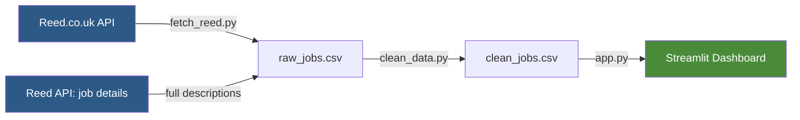
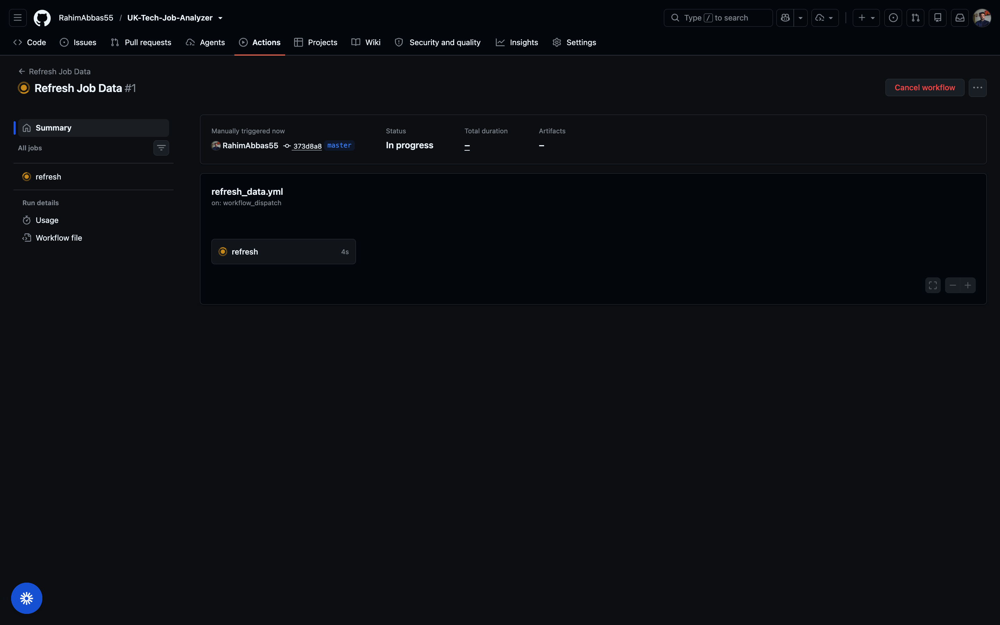
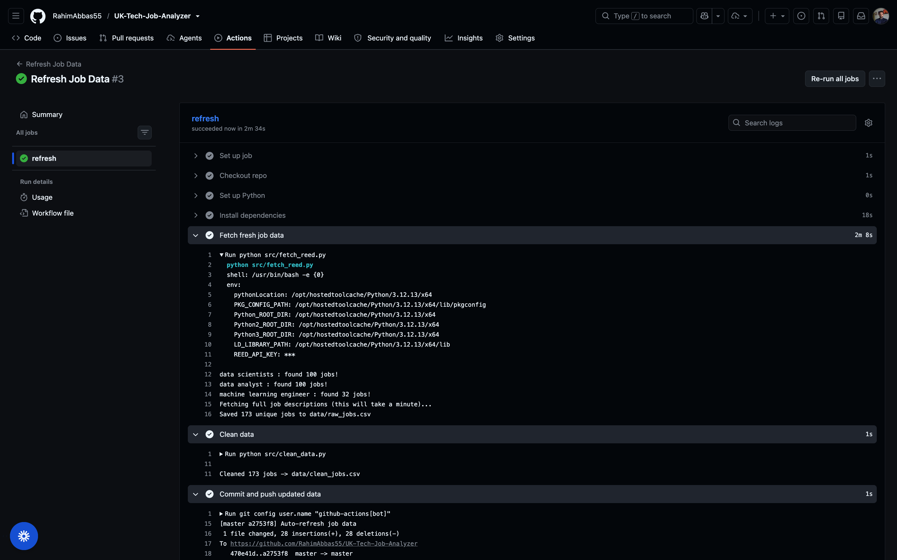
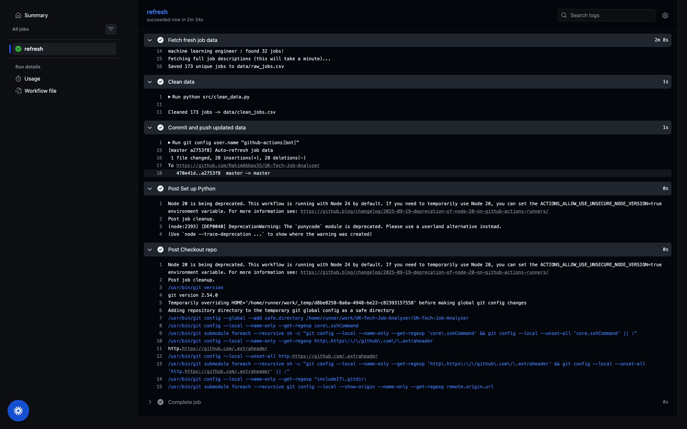
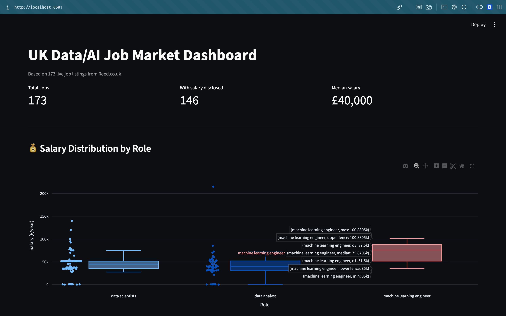

<div align="center">

# 🇬🇧 UK Data Science / AI Job Market Analyser

**An interactive dashboard analysing live UK data science and AI job listings —
salary trends, in-demand skills, seniority mix, and hiring patterns.**

Built using the official Reed.co.uk Jobseeker API.

[](https://www.python.org/)
[](https://streamlit.io/)
[](https://pandas.pydata.org/)
[](https://plotly.com/)
[](#-automated-data-refresh)

[](https://uk-tech-job-analyzer-ks.streamlit.app/)

**[→ View the live dashboard](https://uk-tech-job-analyzer-ks.streamlit.app/)**

</div>

---

## 📋 Contents

- [System Architecture](#-system-architecture)
- [What It Does](#-what-it-does)
- [Data Quality Notes](#-data-quality-notes)
- [Automated Data Refresh](#-automated-data-refresh)
- [Stack](#-stack)
- [Setup](#-setup)
- [Screenshots](#-screenshots)
- [Author](#-author)

---

## 🏗️ System Architecture



**Pipeline stages:**

| Stage | Script | Purpose |
|---|---|---|
| 1️⃣ Collect | `fetch_reed.py` | Searches Reed's API for data/AI roles, then fetches full job descriptions per listing (search results alone are truncated) |
| 2️⃣ Clean | `clean_data.py` | Parses salaries, extracts skills via regex, detects seniority, filters agencies |
| 3️⃣ Present | `app.py` | Streamlit dashboard with interactive Plotly charts |

---

## ✨ What It Does

- 🔍 Pulls live job listings across data scientist, data analyst, and ML engineer roles
- 📄 Fetches full job descriptions (not just search snippets) for accurate skill detection
- 🧹 Extracts skills, seniority level, and salary data using regex-based parsing
- 🏢 Filters out recruitment agencies and training providers to surface genuine hiring employers
- 📊 Visualises everything in an interactive Streamlit dashboard

---

## 🔎 Data Quality Notes

Real issues found and fixed while building this — not just tutorial-following:

- **Truncated descriptions:** Reed's search endpoint caps job descriptions at ~450
  characters. Switched to per-job detail calls to pull full text, which meaningfully
  improved skill-detection accuracy.
- **Misleading "top employers":** Some of the top posters were actually training
  providers or recruitment agencies, not genuine hiring companies. Added keyword +
  manual filtering to surface real employers.

---

## 🔄 Automated Data Refresh

Job data refreshes automatically every 3 days via a scheduled **GitHub Actions**
workflow — no manual re-running required. It fetches fresh listings, rebuilds the
cleaned dataset, and commits the update back to the repo automatically.

<table>
<tr>
<td align="center"><b>Workflow running</b><br></td>
<td align="center"><b>Successful run</b><br></td>
<td align="center"><b>Confirmed complete</b><br></td>
</tr>
</table>

---

## 🛠️ Stack

`Python` · `Pandas` · `Plotly` · `Streamlit` · `Reed.co.uk API` · `GitHub Actions`

---

## ⚙️ Setup

```bash
# 1. Get a free API key
# https://www.reed.co.uk/developers/jobseeker

# 2. Create and activate a virtual environment
python3 -m venv venv && source venv/bin/activate

# 3. Install dependencies
pip install -r requirements.txt

# 4. Add your API key
echo "REED_API_KEY=your_key_here" > .env

# 5. Run the pipeline
python src/fetch_reed.py
python src/clean_data.py

# 6. Launch the dashboard
streamlit run app.py
```

---

## 📸 Screenshots

**Salary distribution by role**


**Most in-demand skills**


**Seniority mix & top hiring companies**


---

## 👤 Author

**Rahim Abbas**
Built while researching my own transition into data science/AI roles in the UK.

[](https://github.com/RahimAbbas55)
[](https://www.linkedin.com/in/rahim-abbas-b5520b258/)