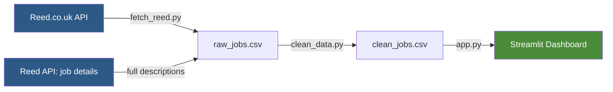
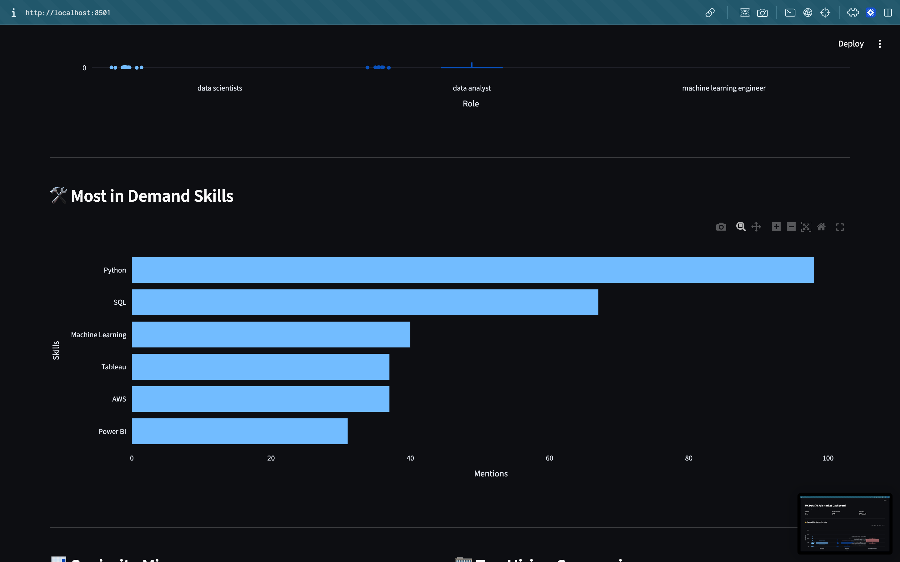
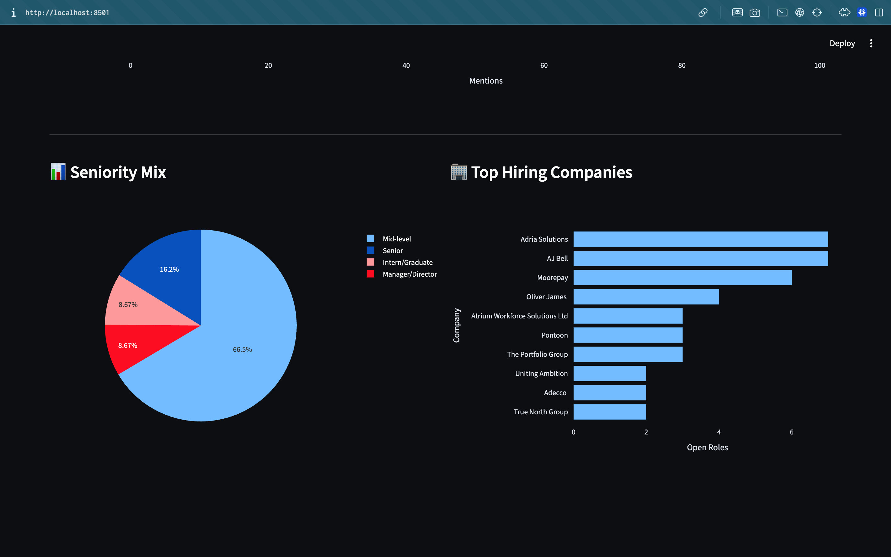

# UK Data Science / AI Job Market Analyser

An interactive dashboard analysing live UK data science and AI job listings —
salary trends, in-demand skills, seniority mix, and hiring patterns — built
using the official Reed.co.uk Jobseeker API.

## Live demo
[COMING SOON!]

## System architecture

**Pipeline stages:**
1. **Collect** (`fetch_reed.py`) — searches Reed's API for data/AI roles, then fetches full job descriptions per listing (search results alone are truncated)
2. **Clean** (`clean_data.py`) — parses salaries, extracts skills via regex, detects seniority, filters agencies
3. **Present** (`app.py`) — Streamlit dashboard with interactive Plotly charts

## What it does
- Pulls live job listings across data scientist, data analyst, and ML engineer roles
- Fetches full job descriptions (not just search snippets) for accurate skill detection
- Extracts skills, seniority level, and salary data using regex-based parsing
- Filters out recruitment agencies and training providers to surface genuine hiring employers
- Visualises everything in an interactive Streamlit dashboard

## Data quality notes
A few real issues I found and fixed while building this:
- Reed's search endpoint truncates job descriptions to ~450 characters — switched
  to per-job detail calls to get full text for accurate skill matching
- Some "top hiring companies" were actually training providers or recruitment
  agencies rather than genuine employers — added keyword + manual filtering

## Stack
Python, Pandas, Plotly, Streamlit, Reed.co.uk API

## Setup
1. Get a free API key: https://www.reed.co.uk/developers/jobseeker
2. `python3 -m venv venv && source venv/bin/activate`
3. `pip install -r requirements.txt`
4. Create `.env` with `REED_API_KEY=your_key_here`
5. `python src/fetch_reed.py`
6. `python src/clean_data.py`
7. `streamlit run app.py`

## Screenshots

**Salary distribution by role**

**Most in-demand skills**

**Seniority mix & top hiring companies**

---

## Author

**Rahim Abbas**
Built while researching my own transition into data science/AI roles in the UK.

[GitHub](https://github.com/RahimAbbas55) · [LinkedIn](https://www.linkedin.com/in/rahim-abbas-b5520b258/)